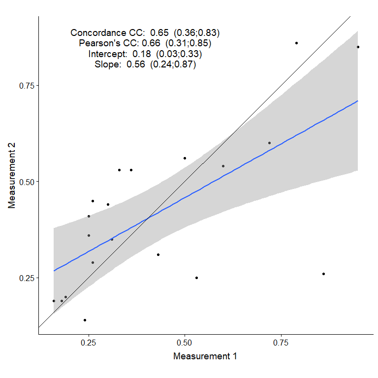

<!-- README.md is generated from README.Rmd. Please edit that file -->

# ggccc

The goal of ggccc is to provide a simple function to create a plot
containing the relevant visual and summary statistic information for
interpreting a concordance correlation coefficient (CCC). The key (and
only, thus far) function is `gg_ccc`.

Note that in future the function will likely be changed to `gg_cc`, with
options added to make it more appropriate for plots that don’t use the
CCC but do use other correlation coefficients.

## Installation

You can install the current version from GitHub using the following:

``` r
devtools::install_github( "MiguelRodo/ggccc" )
```

## Example

This is an example of the output from `gg_ccc`.

``` r
library(ggccc)
data( test_tbl )
gg_ccc( test_tbl, x = "CD4", y = "CD8",  
        shift_x = 20, shift_y = 4, 
        table_font_size = 5,
        table_font_gap = 3.2 ) +
  cowplot::theme_cowplot()
```


